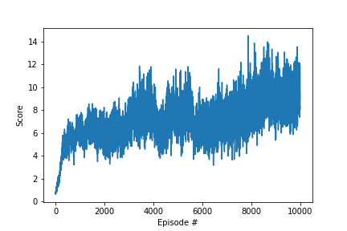
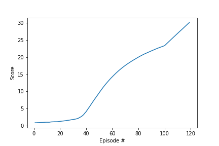

# Project 2: Continuous Control

## Introduction

In this environment, a double-jointed arm can move to target locations. A reward of +0.1 is provided for each step that the agent's hand is in the goal location. Thus, the goal of your agent is to maintain its position at the target location for as many time steps as possible.

The observation space consists of 33 variables corresponding to position, rotation, velocity, and angular velocities of the arm. Each action is a vector with four numbers, corresponding to torque applicable to two joints. Every entry in the action vector should be a number between -1 and 1.


## Evolution Strategy

I have been facinated by one policy based approach which is the evolution strategy, simply becausse it use the same strategy of the evolution, and so the randomness is the main tool. I wanted to solve this problem using this method although I knew it was not the most efficient method for this problem. First I solved quite easily the [Bipedal Walker](https://gym.openai.com/envs/BipedalWalker-v2/) from open Ai gym, just by adapting few hyperparameters. 
To solve the Reacher environment, I managed to reach the score 3 with the first approach so I tried to improve the alogorithm using various techniques.

### Architecture
When I could solved the [Bipedal Walker](https://gym.openai.com/envs/BipedalWalker-v2/) walker without hidden layer, this seemed completly impossible for the complexity of this problem. I added a hidden layer of 128 neurons to solve this problem. This already show a good improvement.

### Adaptive Noise
I introduced in the algorithm an adaptive scaler that increase the standard deviation when the algoritm was not progressing, and decrease it otherwise. This allow to explore in an adaptive way. 

### Drop out layers
In the evolution algorithm there is no backward propagation. I wanted to find a way not to change all neurons at the same time, and make evolved a subset of those neurons. When generating a new noise to update the new weight I wanted to disable some neurons, in the same way we use dropout layers. To do that I used a filer that was disabling the new generating noise for 20% of the neurons : 
```python
new_weight = previous_best_generation_weight + np.random.choice(2, size=weight_count, p=[0.2, 0.8]) * noise_for_the_next_generation
```
Similarly than the droput layer, 20% of the neurons waas fixed during this evolution. This technique brought a significant improvment. 

### Weighted generation 
In the original evolution the new generation is based on percentage of the population. For example we keep 20% of the best new population. The mean of the network weights of this percentage is used to create the new generation.
Here instead of using the mean, I used a weighted average, so to build the next generation the strongest agent will use more its weight than the second best agent and so on. I used this technique inspired from the eveolution in life. The most powerful in a herd usually reproduce more. 

```python
avg_weight = np.arange(elite_population_count) + np.ones(elite_population_count)
# elite_weights : Elite weights selected for the next generation sorted from weaker to stronger
best_weight_avg = np.average(elite_weights, axis=0,  weights=avg_weight)
```

### Various generation
For the next generation I used three types of new generation: 
- One is generation is using the mean of the weights
- The other is using a weighted average, 1 for the weaker, 2 for the one stronger of the weaker...etc and so on and n for the strongest one.
- Another generation use the score as weight for the weighted average. I took advantage than the rewards are positive in this environment to compute a specific weighted average. 
```python
best_weight_rewards = np.average(elite_weights, axis=0,  weights=elite_rewards)
```

### Conclusion
The evolution strategy is impressive to solve really complex problem without using backpropagation. This technique is based only on generating random weights. By the previous improvement described I could increase the score from 3 to reach above 10.
All the source code is available [in this repository](https://github.com/Vinssou/ReacherEvolution)



## DDPG Architecture
Although the Evolution Stategy shows impressive result, I couldn't solve this environment in a decent amount of time. My second attempt was to try the DDPG architecture. 

### Network Archtitecture
This architecture used two neural network, an actor that predict the action, and a critci that predict the value function.  Both of those neural network used a target network. So there are 4 neuraal netwok in total.

### Soft update
At every step we update the weight of the target networks.

### Hyperparameters

```python
BUFFER_SIZE = 100000    # replay buffer size
BATCH_SIZE = 256        # minibatch size
GAMMA = 0.99            # discount factor
TAU = 1e-3              # for soft update of target parameters
LR_ACTOR = 1e-3         # learning rate of the actor 
LR_CRITIC = 1e-3        # learning rate of the critic
WEIGHT_DECAY = 0.0      # L2 weight decay

EXPLORATION_DECAY = 0.999999
EXPLORATION_MIN = 0.01
LEARN_FREQUENCY = 20*20
LEARN_COUNT = 10
```

### Batch Learning
The learning 

### Resolution


## Conclusion
Actor Critic architecture using PPO and GAE... DDPG4 
